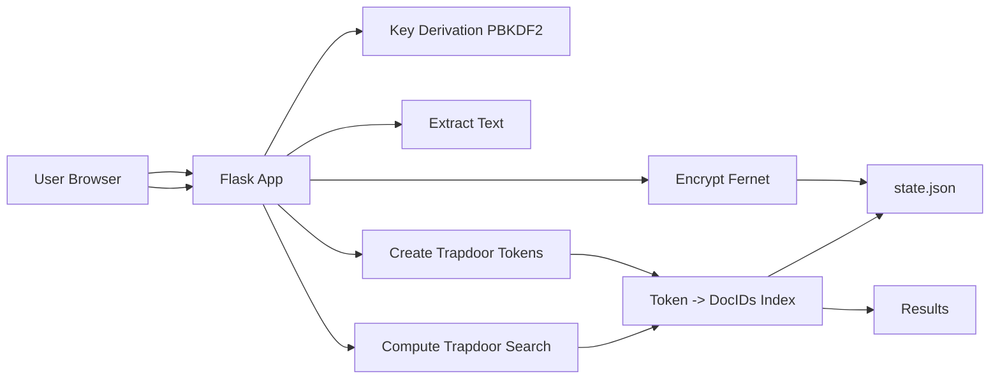
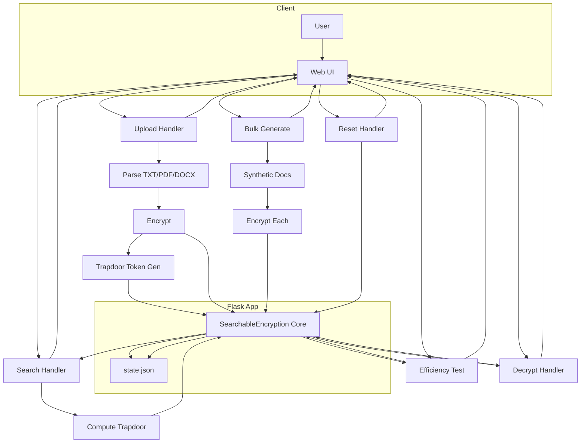
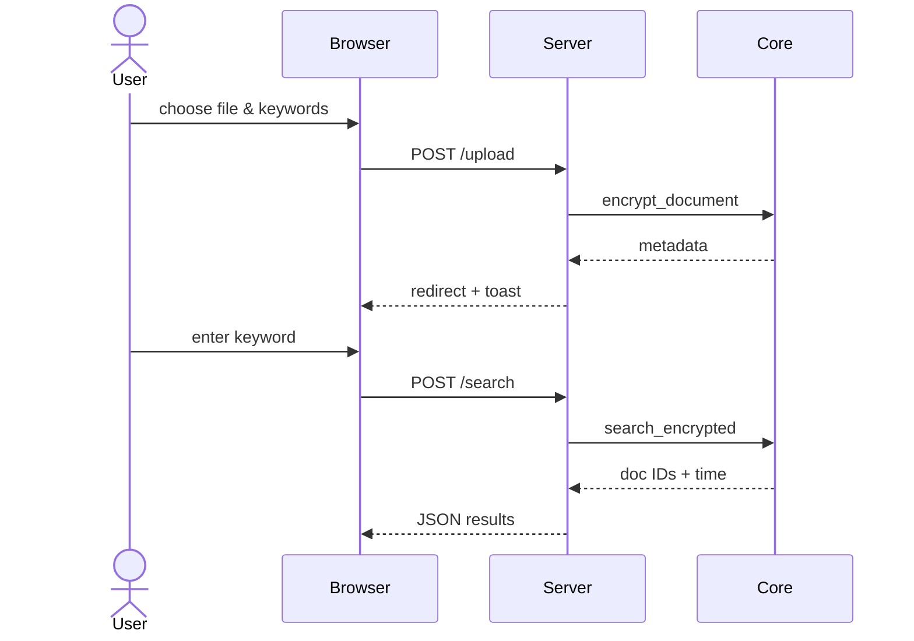

# Application Flow Diagrams

This document contains the Mermaid diagrams describing the searchable encryption application architecture, request flow, and key interactions.

## 1. High-Level Encryption & Search Flow

## 2. Extended Application Flow (All Core Routes)

## 3. Sequence Diagram (Upload & Search)

## 4. Legend / Notes
- **Trapdoor Token:** SHA256(index_key || lowercase(keyword)) — deterministic; leaks equality of queries.
- **State Persistence:** `state.json` stores ciphertexts (base64) + token index + metadata.
- **Bulk Generation:** Produces synthetic documents to test scalability quickly.
- **Reset Route:** Secure wipe of in-memory structures and persisted file (requires confirmation word `erase`).

---
For additional architectural evolution (e.g., forward-private SSE, multi-user tenancy, ORAM layers), new nodes can be appended beneath the core encryption component.
