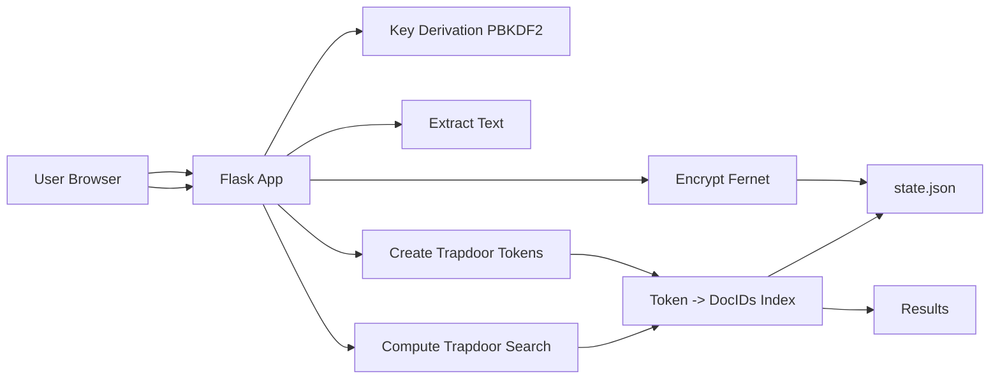
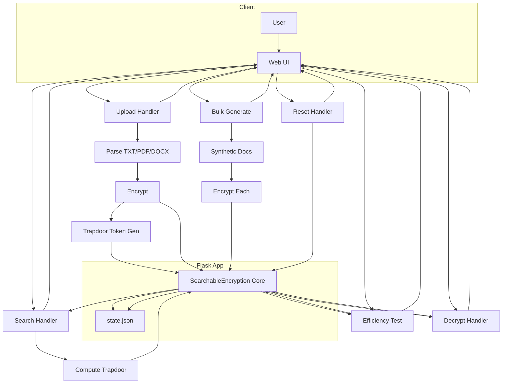
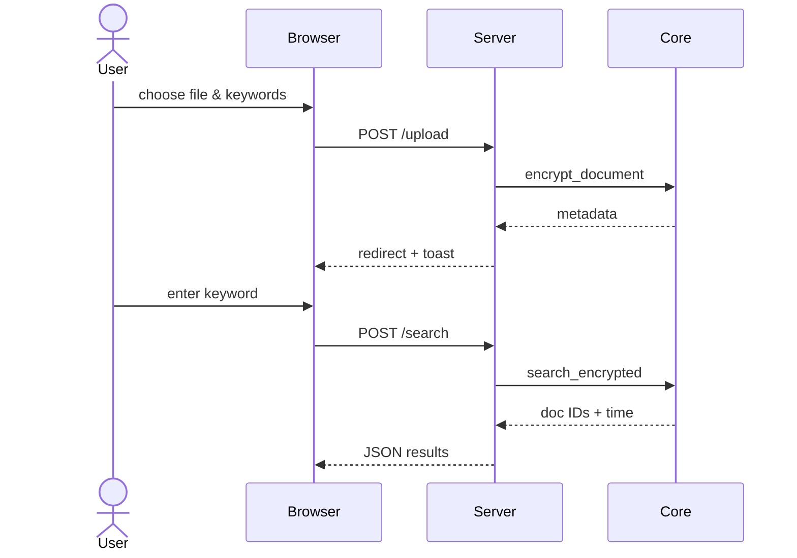

# Searchable Encryption for Secure Cloud Document Sharing — Report

---
## 1. Introduction

Searchable Encryption (SSE) enables searching over encrypted data without decrypting it on an untrusted server. This project demonstrates a practical SSE prototype: users upload documents, the system encrypts content end‑to‑end, and builds a privacy‑preserving keyword index that supports keyword queries via trapdoor tokens. A web UI (Flask + Bootstrap) provides document ingestion, secure search, efficiency metrics, and data reset.

---
## 2. Motivation

- Organizations increasingly store sensitive documents in cloud environments but still need fast search.
- Plaintext indexing leaks information; full homomorphic approaches are expensive.
- SSE provides a middle path: good performance with controlled leakage, suitable for many real‑world scenarios where exact keyword matching is sufficient.

---
## 3. Objective

- Build a working SSE demo application with a simple, professional UI.
- Encrypt all document contents using authenticated encryption.
- Index only keyed hashes (trapdoors) of keywords; never store plaintext keywords on the server.
- Support fast search by keyword and report timing statistics.
- Validate basic confidentiality properties (heuristics) and test scalability (hundreds of documents).

---
## 4. Related Work

- Song, Wagner, Perrig (2000): First practical schemes for searching over encrypted data.
- Curtmola et al. (2006): Formal security definitions and efficient SSE constructions.
- Cash et al. (2013/2014): Practical dynamic SSE (OXT) with sub‑linear search and rich queries.
- Cryptographic Libraries: Python `cryptography` (Fernet) for authenticated symmetric encryption.

This project adopts a simple deterministic token index (keyed SHA‑256) for clarity and performance. It is not a full OXT/forward‑private SSE scheme, and therefore exhibits equality/query pattern leakage as discussed in the literature.

---
## 5. Problem Statement

Design and implement a system that:
- Stores documents encrypted at rest so the server never sees plaintext.
- Supports keyword search by generating trapdoor tokens server‑side from user queries without revealing keywords in storage.
- Offers a usable web interface for upload, search, efficiency testing, and bulk data generation.
- Persists state (ciphertexts, index) safely in a machine‑readable format.

Constraints and assumptions:
- Keyword equality leakage is acceptable for the prototype (deterministic tokens).
- Exact keyword matching (case‑insensitive normalization) suffices.
- PDF text extraction is best‑effort (scanned PDFs require OCR, not included).

---
## 6. Proposed Model

- Cryptography:
  - Document Encryption: Fernet (AES‑128‑CBC + HMAC‑SHA256; tokenized format with timestamp) via `cryptography`.
  - Key Derivation: PBKDF2‑HMAC‑SHA256 (100k iters) → two independent keys:
    - Encryption key (base64 for Fernet)
    - Index key (raw) for token derivation
- Trapdoor Tokens:
  - Token = SHA‑256(index_key || lowercase(keyword))
  - Server stores mapping: token → set(doc_ids)
  - Search computes token for input keyword and returns associated doc IDs
- Persistence:
  - JSON file `state.json` holds ciphertexts (base64), token→doc index, and metadata
- Document Parsing:
  - `.txt`: UTF‑8 decode
  - `.pdf`: PyPDF2 then pdfminer.six fallback
  - `.docx`: python‑docx

---
## 7. Flowdiagram of Proposed Model

# Application Flow Diagrams

This document contains the Mermaid diagrams describing the searchable encryption application architecture, request flow, and key interactions.

## 1. High-Level Encryption & Search Flow

## 2. Extended Application Flow (All Core Routes)

## 3. Sequence Diagram (Upload & Search)

## 4. Legend / Notes
- **Trapdoor Token:** SHA256(index_key || lowercase(keyword)) — deterministic; leaks equality of queries.
- **State Persistence:** `state.json` stores ciphertexts (base64) + token index + metadata.
- **Bulk Generation:** Produces synthetic documents to test scalability quickly.
- **Reset Route:** Secure wipe of in-memory structures and persisted file (requires confirmation word `erase`).

---
For additional architectural evolution (e.g., forward-private SSE, multi-user tenancy, ORAM layers), new nodes can be appended beneath the core encryption component.

## 8. Model Description

Components:
- UI (Bootstrap + Chart.js): clean forms for upload/search; timing chart for efficiency tests.
- Flask Backend: routes for upload, search, decrypt, efficiency test, bulk generation, and secure reset.
- SSE Core (`searchable_encryption.py`):
  - `encrypt_document(id, content, keywords)` → ciphertext + updates token index
  - `search_encrypted(keyword)` → result_count, doc IDs, elapsed time
  - `decrypt_document(id)` → plaintext (authorized)
  - `validate_confidentiality(id)` → heuristic checks (used during development; removable)
  - State load/save helpers

Data Structures:
- `encrypted_documents: dict[doc_id -> bytes]`
- `encrypted_keyword_index: dict[token_hex -> set[doc_id]]`
- `document_metadata: dict[doc_id -> {...}]`

Security/Leakage Discussion:
- Strengths: ciphertext confidentiality (Fernet AEAD), no plaintext keyword storage, strong KDF.
- Leakage: deterministic tokens reveal repeated queries; server learns result sizes (access pattern).
- Mitigations (future work): randomized, forward‑private indices; ORAM/DP techniques; OXT‑like protocols.

---
## 9. Implementation Results

Environment: Python 3.9+; libraries from `requirements.txt`.

Empirical observations on a typical laptop (will vary by hardware):
- Single keyword search: < 1 ms (token lookup + set read)
- 100 repeated searches: ~1–2 µs average per query (Python timer granularity applies)
- Bulk generation (e.g., 500 docs): completes within seconds; average per‑doc encryption typically sub‑millisecond for short texts

Functional validation:
- Encrypted keyword index shows only truncated hashes in the UI sample.
- Search operates solely on trapdoor tokens, never on plaintext keywords in storage.
- Reset wipes `state.json` and `uploads/` to return to a clean slate.

Limitations observed:
- Scanned PDFs (image‑only) contain no text—require OCR to extract searchable content.
- Deterministic tokens leak keyword equality/frequency patterns.

---
## 10. Conclusion

This project delivers a working end‑to‑end demonstration of SSE in a familiar web application form. It shows that practical encrypted search is achievable with modern libraries and careful indexing, while highlighting standard leakage trade‑offs. It serves as a solid foundation for coursework, demos, and as a starting point for more advanced SSE protocols (e.g., OXT) and production‑grade controls (auth, RBAC, rate‑limiting, auditing, and improved secret management).

---
## References

1. Dawn Xiaodong Song, David Wagner, and Adrian Perrig. Practical Techniques for Searches on Encrypted Data. 2000.
2. R. Curtmola, J. Garay, S. Kamara, and R. Ostrovsky. Searchable Symmetric Encryption: Improved Definitions and Efficient Constructions. CCS 2006.
3. D. Cash, S. Jarecki, C. Jutla, H. Krawczyk, M. Rosu, and M. Steiner. Highly-Scalable Searchable Symmetric Encryption with Support for Boolean Queries. CRYPTO 2013.
4. The `cryptography` library (Fernet): https://cryptography.io/en/latest/fernet/
5. PyPDF2: https://pypi.org/project/PyPDF2/
6. pdfminer.six: https://pypi.org/project/pdfminer.six/
7. python-docx: https://pypi.org/project/python-docx/
